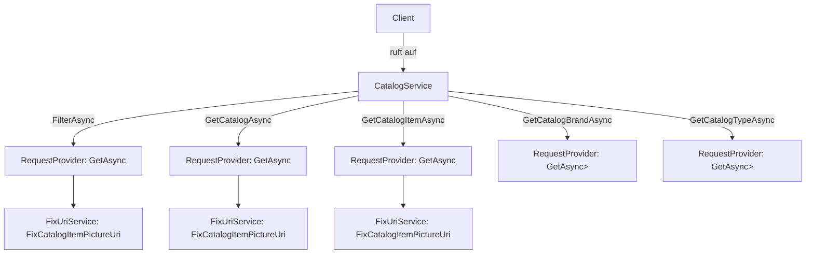

# Ablaufdiagramm für CatalogService

Dieses Diagramm visualisiert die wichtigsten Methoden und deren Ablauf im `CatalogService` der eShop-ClientApp.

## Übersicht

- **FilterAsync**: Filtert Katalogartikel nach Marke und Typ.
- **GetCatalogAsync**: Ruft alle Katalogartikel ab und korrigiert die Bild-URIs.
- **GetCatalogItemAsync**: Ruft einen bestimmten Katalogartikel ab und korrigiert die Bild-URI.
- **GetCatalogBrandAsync**: Ruft alle verfügbaren Marken ab.
- **GetCatalogTypeAsync**: Ruft alle verfügbaren Typen ab.

## Mermaid-Diagramm

Die Datei [`CatalogService.mmd`](./CatalogService.mmd) enthält das folgende Mermaid-Diagramm:

## Hinweise
- Die Methoden nutzen jeweils den `RequestProvider` für HTTP-Anfragen.
- Die Bild-URIs werden nach dem Abruf der Katalogdaten durch den `FixUriService` korrigiert.
- Die Diagrammdatei kann mit [Mermaid Live Editor](https://mermaid.live/) oder direkt in unterstützenden Editoren angezeigt werden.
